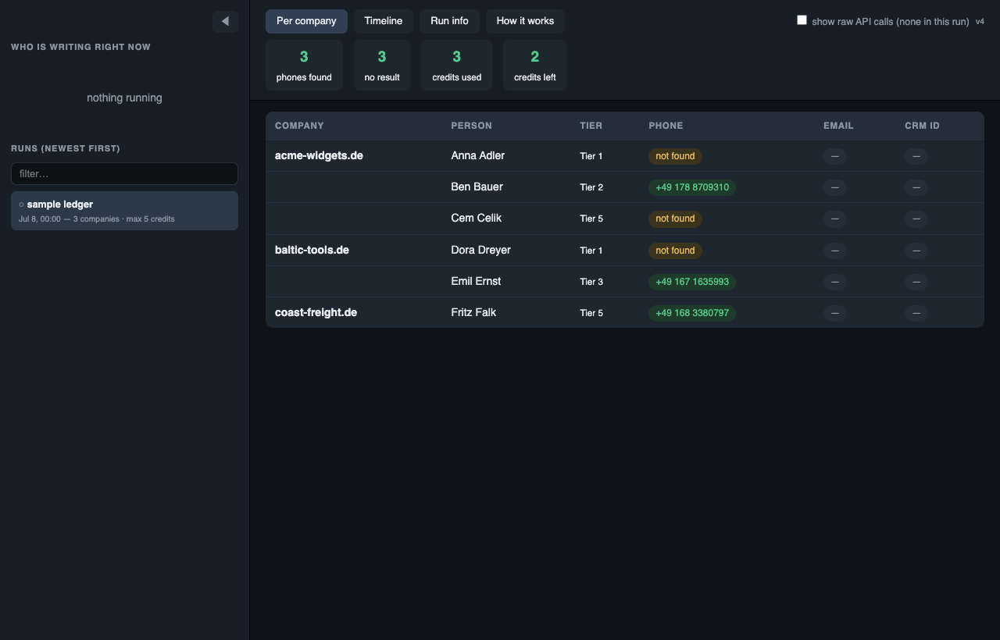
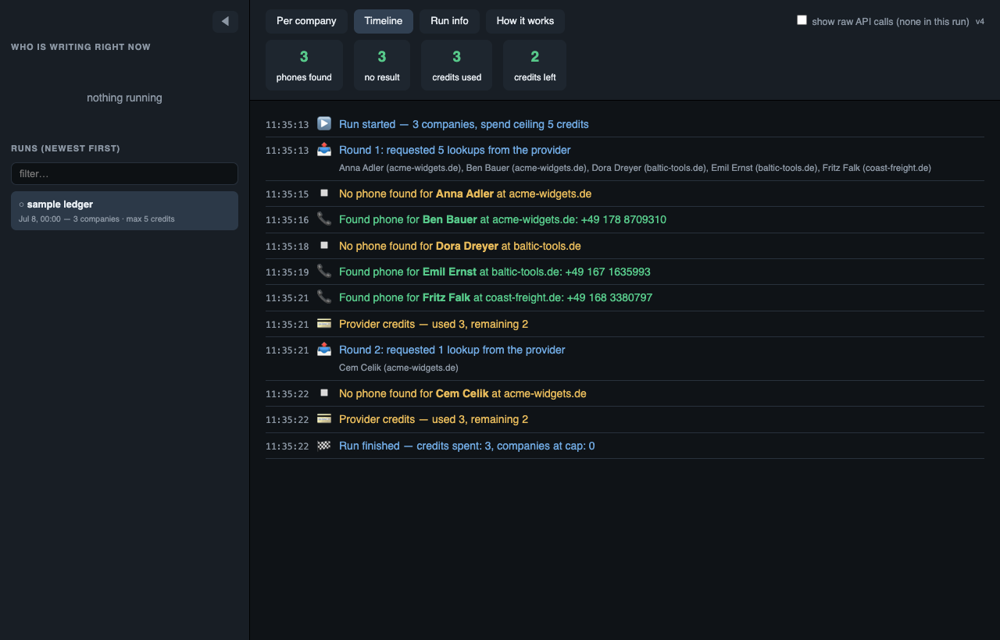
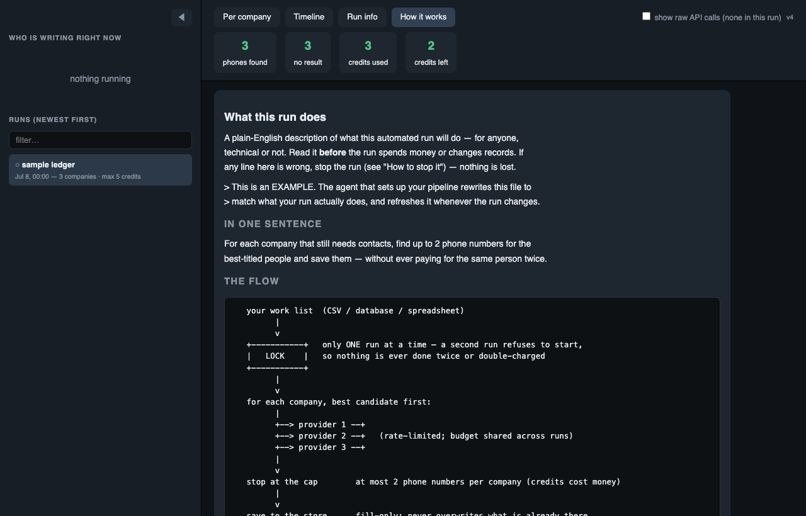
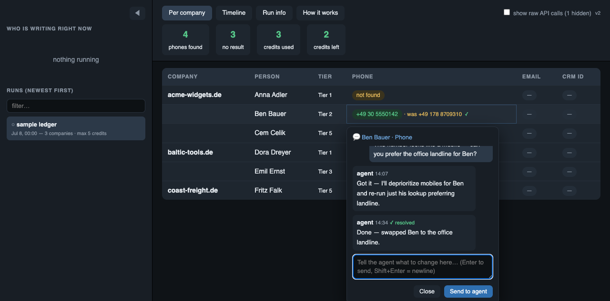

# observer-kit

Guardrails and a live localhost dashboard for any script that **spends API
credits** or **mutates shared state** (CRM, database, spreadsheets) — packaged
as an installable agent skill.

It gives batch / enrichment / scraping scripts three things, all stdlib-only,
no dependencies:

- **Run locks** — a second accidental run refuses to start, so nothing
  double-spends or corrupts data. Crash-safe: recovery is "just re-run", never a
  manual cleanup.
- **An audit ledger + cross-process rate limiting** — every submission, result,
  and credit recorded; parallel runs share one rate budget per provider.
- **A boring default wrapper** — `start_observed_run(...)` gives new scripts a
  run id, lock, dry-run flag, visible step rows, counters, checkpoints, and
  `success()` / `fail()` lifecycle closure without inventing a run harness.
- **A read-only web dashboard** (`http://localhost:8484`) — a live per-record
  table, an at-a-glance activity strip, an Attention tab for failures/refusals,
  a plain-English timeline, a run-info tab, and a **"How it works"** tab that
  renders a plain-English + ASCII `EXPLAIN.md` so a non-technical operator can
  verify what a run is doing and stop it if it's wrong.

## What it looks like

**Data** — one row per item; columns are whatever the run logs, and pills fill in live as results land:



**Timeline** — every step in plain English, newest work as it happens:



**How it works** — a plain-English + ASCII "statement of intent" (from
`EXPLAIN.md`) the operator reads to confirm what a run will do *before* it spends:



**Collaborate on a sample** — click any column header or cell to chat with the
agent, anchored to that exact spot. The intended loop: the agent runs a small
sample, you leave notes on what to change, it replies and marks them ✓, and the
next run shows **before/after** inline (`· was X`) so you see what changed —
before committing the full (expensive) run.



## Any workflow, any columns

The dashboard is **not** hardcoded to contacts/phones/emails. Log a generic
`record` event and the **Data** tab builds a table whose columns are exactly the
fields you logged — for *any* pipeline:

```python
# log where each row came FROM and went TO — lineage is just more columns
runguard.ledger('my-run', 'record', table='companies', key=domain,
                company=domain, source='northdata',        # pulled_from
                condition='met', supabase='inserted',       # per-sink outcomes
                hubspot='pushed', csv='written', status='done')
```

- **`table`** groups records into separate **sub-tabs** — a multi-step workflow
  emits a different shape at each step (e.g. `companies` → `contacts` → `enriched`),
  each its own table, so a later step's rows don't bury an earlier one's.
- **`key`** is the row identity — repeat it to update a row in place; a changed
  value renders `· was X` (before/after). Log the outcome onto the same key at each
  step and the row accumulates its whole path (source → each sink).
- Every other field becomes a **column**, in first-seen order. A destination
  (`supabase`, `hubspot`, `cloudflare`, `csv`, a webhook…) or a source is just a
  column — there's no fixed list.
- **Outcome columns auto-color**: values are classed green (`done/ok/inserted/pushed/
  written/created/appended`), amber (`skipped/not met/held/pending`), red (`fail/
  error/refused/4xx/5xx`), grey (`—`/not attempted) by a universal vocabulary — no
  per-workflow config. So "what landed where" reads straight off the colored cells.
- **Top bar stays lean**: per-table row counts (companies, people…), the run's own
  headline totals from `run_finished` (e.g. `emails_found`), and credits used — not
  a per-value dump.
- Table UX applies everywhere: first column frozen on horizontal scroll, sticky
  header on vertical scroll, drag a header edge to resize, double-click a cell to
  expand long values, click any cell/header to chat.

The bundled contact-enrichment view (phones/emails/CRM pills) is just the *example*
renderer that kicks in for `phone_found`/`email_found` events — remove it or ignore
it; `record` events are the general path.

## The boring wrapper

For new scripts, use the small helper instead of hand-assembling the lock,
ledger, dry-run, counters, and lifecycle every time:

```python
from runguard import start_observed_run

run = start_observed_run('enrich-leads', dry_run=args.dry_run, todo=len(leads))

try:
    for lead in leads:
        with run.step('enrich_lead', table='companies', key=lead.id,
                      company=lead.domain):
            enriched = enrich_lead(lead)
            if not run.dry_run:
                update_crm_lead(lead.id, enriched)
            run.count('leads_enriched')
            run.checkpoint('last_lead', lead.id)

    run.success(processed=len(leads))
except Exception as exc:
    run.fail(exc)
    raise
```

Drop to `acquire_lock()` + `ledger()` only when a pipeline needs custom event
vocabulary. The default path is meant to stay small enough to add in minutes.

## Default run policy

For workflows that spend credits, scrape in bulk, send messages, or write to a
CRM/database/spreadsheet, start with a small dry-run sample and get explicit
approval before the full run.

Recommended CLI shape:

```bash
python3 workflow.py --dry-run --limit 10   # sample only; review dashboard
python3 workflow.py --limit 10             # optional live sample after approval
python3 workflow.py --full-run             # full run only after explicit approval
```

The full dataset should be an intentional action, not the default path.

## Install

As a local CLI from this checkout:

```bash
python3 -m observer_kit --help
```

If you want the `observer-kit` console command, install from a Python
environment where user/site packages are writable:

```bash
python3 -m pip install -e .
observer-kit --help
```

Into your user scope (available in every project you open):

```bash
npx skills add edsmkt/observer-kit -g
```

Or into a single project's `./.claude/skills/`:

```bash
npx skills add edsmkt/observer-kit
```

Then, in any project, ask your agent to "wire in observer-kit" — or it will
reach for the skill on its own when it's about to write a credit-spending or
state-mutating batch script.

## Try it in 30 seconds

```bash
git clone https://github.com/edsmkt/observer-kit
cd observer-kit
python3 -m observer_kit test       # verify the safety core — 15 checks, all pass
python3 -m observer_kit dashboard skills/observer-kit/.runguard
python3 skills/observer-kit/example_worker.py --table alpha
python3 skills/observer-kit/example_worker.py --table alpha  # second copy REFUSES
```

## CLI

```bash
observer-kit init ./my-project
observer-kit dashboard ./my-project/.runguard --port 8484
observer-kit watch ./my-project/.runguard --run runguard:my-run.jsonl --follow
observer-kit watch ./my-project/.runguard --all --follow
observer-kit run --state-dir ./my-project/.runguard --dashboard -- python3 enrich_companies.py --dry-run --limit 10
observer-kit run --state-dir ./my-project/.runguard --session auto -- python3 enrich_companies.py --full-run
observer-kit reply ./my-project/.runguard --run runguard:my-run.jsonl --anchor cell:companies:2 --text "Fixed this and reran the sample."
observer-kit test
observer-kit doctor ./my-project
```

`init` vendors `runguard.py` and `watch_chat.py`, creates `.runguard`, copies
the `EXPLAIN.md` template, and writes a small `.runguard/.gitignore`.

`watch` is a harness bridge, not an agent. It reads dashboard chat for one run
and emits structured `OBSERVER_CHAT_EVENT ...` lines to stdout so the active
Codex/Claude/Goose/etc. session can decide what to inspect, patch, rerun, or
reply. Observer Kit is the observed run substrate and event transport; the
harness thread/session remains the brain. The harness must run or monitor this
stdout bridge for notes to wake the active session.

For a long-lived dashboard server, prefer `observer-kit watch .runguard --all
--follow` in the active harness session. It bridges notes from any run in that
dashboard state directory, including completed runs the operator clicks later.

`run` is the convenience launcher for agent-started pipelines. It sets
`RUNGUARD_STATE_DIR`, optionally starts the dashboard, runs the command you pass
after `--`, detects the `OBSERVER_RUN_STARTED` marker from `runguard.py`, and
connects the scoped watcher for that run. After the child command exits, the
dashboard/watch bridge stays alive for sample review until Ctrl-C; use
`--exit-after-run` when you want smoke-test behavior. It does not approve full
runs or make workflow decisions.

For failure recovery on the same source data, keep the same lane: omit
`--session`, or pass the same stable session name again. The retry appends to the
same ledger so the operator sees the failed attempt, checkpoints, fixes, and
successful continuation in one dashboard run.

Use `--session auto` only when you intentionally want a fresh historical run in
the same dashboard state directory, such as a new batch, weekly import, or demo
run. Without a session, `runguard.py` keeps appending to the same source-scoped
ledger so reruns show before/after in one continuous lane.

When a dashboard note asks the agent to change the script, choose the lane based
on operator intent. Fixing or continuing the same dataset should reuse the same
lane, table names, and row keys so updated cells render in place with
before/after values. A clean redo or comparison should use a new session so it
appears as a separate dashboard run.

Parallel runs should share a lock scope unless their input records are provably
disjoint. If two sessions might touch the same website, contact, account, row,
or external object, run them serially. `throttle()` protects provider rate
limits; it does not prevent duplicate work on overlapping records.

## What's inside `skills/observer-kit/`

| File | What it is |
|------|-----------|
| `SKILL.md` | Agent entry point — when to use it and how to wire it in |
| `runguard.py` | Locks + append-only ledger + cross-process throttle — **a library; vendor it into your project** (your script imports it) |
| `run_dashboard.py` | The localhost observer — **a standalone app; run ONE instance** pointed at any project's ledger dir (`python3 run_dashboard.py <dir>`), don't vendor it per-project |
| `watch_chat.py` | Run-scoped chat watcher — surfaces the operator's dashboard notes for **one** run so the right agent session gets them (multi-session safe). Wire into your harness's wake-up (Claude Code: the Monitor tool) |
| `observer_hook.py` | Claude Code PostToolUse hook — catches the `run_started` marker and reminds the agent to start that run's watcher. Add to `.claude/settings.json` on setup (see SKILL) |
| `EXPLAIN.md` | Template for the plain-English + ASCII "statement of intent" |
| `example_worker.py` | Runnable end-to-end example (parallel datasets + throttle) |
| `test_runguard.py` | Acceptance tests for the safety core (lock exclusivity, stale-lock takeover, re-entrancy, scope isolation, ledger append/continuity, cross-process throttle). Run it after vendoring `runguard.py` to prove the guards hold |
| `test_lint_emit.py`, `test_dashboard.py` | Acceptance tests for the live-emission linter and dashboard JSONL reader. `observer-kit test` runs these with the safety-core tests |
| `references/pattern.md` | The full pattern, event vocabulary, dashboard behavior, safety rules |
| `references/build-guide.md` | Rebuild the whole stack from scratch, with acceptance tests |

## License

MIT
